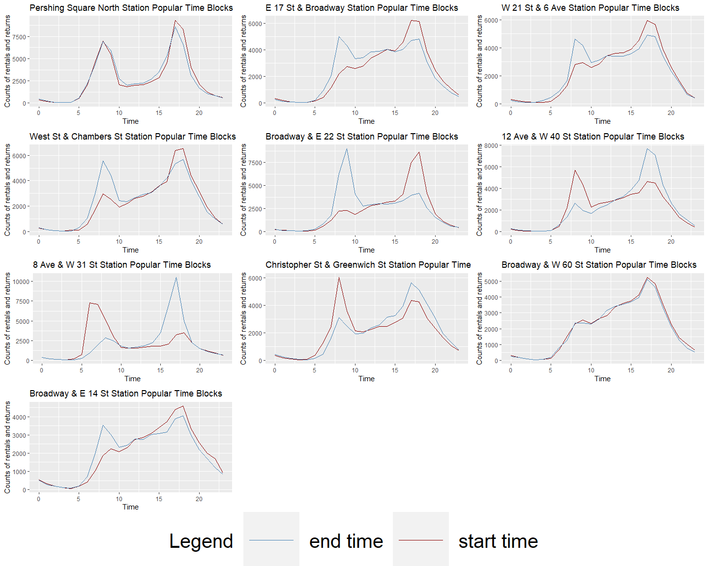

## About

### About Us

We are a group of 5 Computer Science / SDS students from Smith College taking CSC 235: Visual Analytics. Throughout the course, we’ve learned many new data wrangling skills such as visualizing geospatial data, creating interactive graphs, and working with big data. In addition to having the adequate skills to work with movement data, since most of us in the group also have a personal connection to NYC, we chose the CitiBike dataset for our final project. 

### Dataset

The CitiBike dataset consists of information on all trips taken in the boroughs of New York City. The csv files are broken up by month, with each file containing elements such as trip duration, latitude and longitude of start and end dock stations, user type, user gender, years of birth, and etc. Our data can be found here: https://www.citibikenyc.com/system-data. 

We initially wanted to analyze a year worth of data, however, we soon realized that we needed to scale down since we had millions of observations. One of our goals was also to analyze pre-pandemic data, hence, we decided to analyze data in 3-month increments starting with April 2019. This allowed us to scale down the dataset while covering information in each season of the year. In the end, we created a mega dataset with data from 6 months: April 2019, July 2019, October 2019, January 2020, April 2020, and July 2020. 

### Goal/Purpose

We created visualizations based on 3 personas we created in the early prototype phases of our data exploration. Our personas were as follows:

* Persona 1: NYC Local Customers 
Sam is a recent college graduate from Nashville, TN who plans on moving to NYC for her new job. Sam wants to incorporate exercise into her daily routine, hence, when she found out about New Yorkers using Citi Bikes as a mode of transportation, she was instantly interested. Since Sam has never lived in NYC, she doesn’t know which neighborhoods have Citi Bikes. 

* Persona 2: Tourists
The Smith family is visiting New York City for the weekend from Louisiana and has a list of destinations they want to visit. They want to find the closest CitiBike station to their hotel and make their way to Central Park. The Smiths want to visit all the sites throughout Central Park but the daily pass only allows for 30-minute sessions at a time. The Smiths want to plan their trip accordingly and locate the best stations for their day at Central Park. 

* Persona 3: CitiBike Marketing Team
CitiBike is interested in analyzing the pre and post-pandemic customer preference. In order to maximize their profit, the marketing team aims to look into each CitiBike rental locations’ popularity. According to nymag.com, we know that most of the company’s profit comes from short-term customers and subscriptions come from wealthy areas. Therefore, rental locations play an important role in the company’s operation. 

When we were deciding on visuals for each persona, we realized that many of them overlapped as they have very similar needs. Therefore, we created visualizations that would be applicable and insightful for all 3 personas. Our goal was to create a leaflet map that has information on the popularity of each station so our users can easily visualize the data. Next, we also conducted further analysis on different trends based on user type and age. Since our dataset contained information on pre-pandemic and pandemic travels, we inevitably saw many trends caused by the COVID-19 pandemic. Our geospatial visualization caters to users like Sam and the Smith family to locate CitiBike stations and see which ones are popular. Our graphs that quantify information on user type and station popularity over time cater to the CitiBike Marketing team, specifically in locating popular stations and trends over the pandemic that affect their company’s users. You can see our visualizations and their analysis in the ‘Visuals’ tab. 

## Visuals 

### Interactive Map

Can be found in 'leaflet_maps.html'

### Customers vs. Subscribers

### Most/Least Popular Stations 

Purpose of graph: The top 20 popular rental stations in NYC. 

 

 

Analysis: People will have a general idea of which stations are the most popular ones in NYC. For NYC visitors or commuters during the pandemic, they can avoid these crowded stations if possible. Additionally, CitiBike’s marketing team can suggest increasing their investment in the number of bikes at the popular stations to maximize their profits and maybe cut down the bike numbers or even close the stations that have the least number of rentals.

### Peak Hours  
Purpose of graph: Provide CitiBike renters the peak time of top 10 popular stations

 

Analysis: Blue line represents end time while the red represents start time. In order to provide our users, especially local customers and tourists, with the most helpful information, we made plots for the top 10 most popular stations with their corresponding peak rental hours. People who want to rent a bike at those stations can predict when they will most likely be able to get a bike and avoid crowds. 

### Customer vs. Subscribers (by birthyear)
Purpose of Graph: The first graph displays the count of each user type (customer or subscriber) for each birth year for all 6 months collectively and the second graph shows plots for each of the 6 months.

 
 

Analysis: We can see that throughout all the months there is a spike in the year 1969 mainly amongst citibike customers. This unusual spike may be due to 1969 being the default year when customers have to put in their DOB to obtain a citibike. 
From the first graph we can see that collectively from each of the six months, 1990 is the year with the highest number of users right after 1969. And for each of the months separately, 1990 is also the highest for every single month. As we can see clearly from the graphs, the majority of these users are subscribers. This could be useful to the Citibike marketing team because with this information they can invest in placing more stations in neighborhoods that have a large amount of people who are around the age of 30 years old (younger/middle adulthood residents).

Purpose of Graph: Total trip duration (minutes) for each of the six months based on the year of birth of the users

 

Analysis: Throughout all the months, besides the year 1969, 1989-1990 were the years of birth that had the longest trip durations. This is useful to the Citibike marketing team because it shows which age group is using Citibikes for longer or shorter trips. From the previous plots we know that those born in 1990 are also the ones using Citibikes the most frequently and now we can also infer from this plot that they account for the longest trip duration as well.

## Reflection

Since we successfully worked together for most of our Data Challenges, we decided to work on the final project as well. After completing the initial prototype, we divided and each took on a persona. However, after completing the initial exploration and creating visuals, we realized that many of our graphics overlapped. We concluded that since the needs of our personas overlapped, we can combine our graphics and create something that would be insightful for all personas; tourists, locals, and the CitiBike marketing team. Overall, we believe that we reached our goal of consolidating a vast amount of information into accessible visualizations and tools for our personas. The amount of time spent in prototyping before we started data wrangling was crucial to meeting this goal, and the practice and experience gained from previous projects and assignments helped us make visualizations that communicate exactly what we wanted them to.

- Salwa: A common challenge that most of us faced was scaling down the data and narrowing our main focus. The biggest challenge for me was assessing which information would be more or less relevant in supporting our personas. Additionally, another challenge was figuring out how to present the data I wrangled in the most effective way possible. Meeting with my group and getting support and advice from them was very useful for me. We all worked really well together and bounced ideas off of each other which really helped when analyzing the data and coming to our conclusions. 

- Ivy: Breaking down the final project into weekly small tasks and the process of generating prototypes and deciding our aimed readers really helped our final project to be designed smoothly in this remote environment. Some of our group members were New Yorkers, so they were able to provide insights and further analysis through their experiences and familiarities with certain neighborhoods when we were making inferences on the wrangled Citibike datasets. Also, integrating how the pandemic impacted CitiBike usage was a topic that our group members were interested to know more about since covid have severely altered our lives in various ways. It was interesting when we started to put the pieces together and shared what conclusions we obtained from each of our designated parts. Everyone utilized their specialties as we created an analysis that can successfully help our targeted personas.

- Lika: The biggest challenge for me was to think how to visualize the varying popularity of each CitiBike station across the months represented in the dataset. The solution was to map 3 levels of popularity of the stations to colors and represent how the station’s color changes in each month. The group dynamics was very important for making progress in the project. Dividing up the work and coordinating in smaller groups was very helpful and productive. We also used code from our previous projects in SDS 192 to create our interactive leaflet map. 

- Christina: One of our challenges in working with this dataset came early on when we had to decide on how we wanted to scale down. However, we all worked together and came up with a plan that would help us analyze a dataset that would include all different seasons while looking at COVID-19 trends. We were also able to learn that this is a common practice when some of us did the extra-credit report. We also are very compatible with each other’s working/learning styles, hence, we’ve been successful in this class. 

- Carolyn: With the large amount of information provided by CitiBike, the biggest challenge for me was finding a focus for my analysis. Discussions and peer feedback were insightful for me in figuring out what to visualize and why it was important. I really enjoyed working on the user count bar chart, as it gave me more practice working with big data in Jupyter Notebook and provided some perspective on how pandemic trends affect businesses in NYC. 

#### Final points, some room for improvement:

We struggled most centralizing all of our findings into one deliverable. Though we sucessfully completed individual parts of the project, we did not anticipate the amount of difficulty that came with combining eveything into a R Markdown file. Since we are working with a large dataset, we were not able to knit our final file into a website. We decided to brainstorm other ways to approach the final deliverable that would communicate our findings in the way we planned. Our first step towards a more approachable solution was using images of the visualizations for our website. In addition to this, we decided to link separate (much smaller) files into our final file for interactive maps. After consulting with Jordan, we were finally able to produce a website we were proud of. 

Since many of us are NYC residents, we had a personal connection with the dataset and all of us enjoyed working with it. While we believe that we have created an applicable report, we value thinking about potential advancements in our work as well. In early stages of brainstorming and planning, we aimed to focus on the data detailed scale by focusing on day-by-day or week-by-week patterns to get more accurate trends. We also wanted to include interactive elements in each of our visualizations, which also would have provided specificity in broader patterns we illustrate in our graphs. Given the time, these additional aspects would improve how specific our analysis is, while supporting the trends we discovered on a monthly basis. Interactivity, in particular, would help us communicate our findings to other people, who don’t have as much experience 

## Citations

* https://s3.amazonaws.com/tripdata/index.html 
* https://nymag.com/intelligencer/2014/03/citi-bikes-four-huge-problems.html
* https://en.wikipedia.org/wiki/COVID-19_pandemic_in_New_York_(state)#:
* https://benalexkeen.com/bar-charts-in-matplotlib/
* https://datatofish.com/line-chart-python-matplotlib/
* https://stackoverflow.com/questions/10369681/how-to-plot-bar-graphs-with-same-x-coordinates-side-by-side-dodged
* https://plotly.com/python/line-charts/

